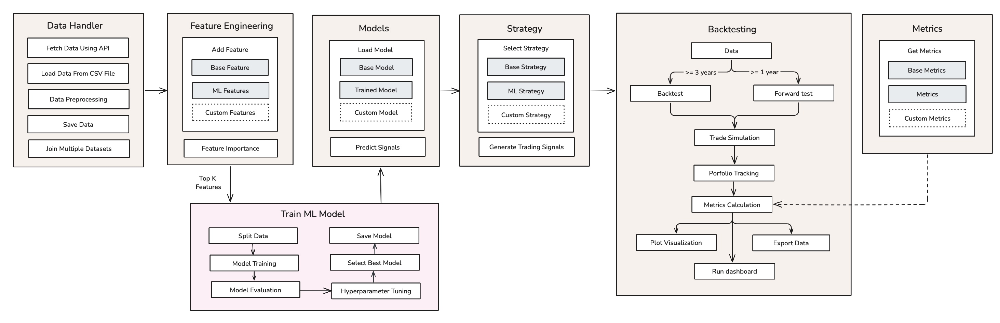

# QuantPilot

## 🚀 Project Overview
QuantPilot is a high-performance, modular backtesting library tailored for designing, evaluating, and refining trading strategies. Built with flexibility in mind, it supports both traditional quantitative methods and cutting-edge machine learning techniques.

With a composable architecture and seamless component integration, QuantPilot empowers quantitative researchers and traders to prototype, test, and deploy alpha-generating strategies efficiently—while accounting for real-world constraints and robust evaluation metrics.


## 🔑 Key Features
- 🔌  **Plug-and-Play Architecture** – Seamlessly integrate custom models, features, metrics, and components with minimal configuration.

- 🧱 **Modular and Composable Design** – Build fully customizable and reusable pipelines tailored to your research and development workflows.
- 🤖 **Machine Learning Ready** – Native support for training, validating, and fine-tuning machine learning models within your strategy framework.

- 🔁 **Backtesting & Forward Testing** – Robust evaluation tools for both historical simulations and forward-looking performance testing in pseudo-live environments.

- 📊 **Interactive Visualization** - Intuitive dashboard to explore backtest and forward test results, strategy signals, and comparative performance metrics.

- ⚙️ **Flexible Strategy Execution** - Easily run single or multiple strategies concurrently, with support for various backtesting modes (e.g., geometric, arithmetic).

- 🧠 **Advanced Feature Engineering** - Powerful tools for statistical feature selection, regime detection using Hidden Markov Models, and clustering with K-Means.

## Getting Started
Prerequisites:
- Python 3.10 or higher
- To install the dependencies, run the following command:
```bash
pip install -e .
```

## Project Structure
```
QuantPilot/
│
├── docs/                               # Documentation resources
│   └── api_reference/                  # Reference documentation for library classes and functions
│   └── tutorials/                      # Step-by-step user guides and examples for using the library
│
├── examples/                           # Example scripts demonstrating how to use the backtester
│   └── single_backtesting.py           # A simple example of a strategy backtest
│
├── experimental/                       # Experimental modules and in-development features
│
├── quantpilot/                         # Main source code for the QuantPilot system
│   ├── data/                           # Data loading and preprocessing utilities
│   │   ├── api/                        # External API integrations (e.g., price feeds)
│   │   └── loader/                     # Functions to load and prepare data from various sources
│   │
│   ├── features/                       # Feature engineering and transformation modules
│   │   ├── base_features.py            # Abstract base class for custom features
│   │   ├── feature_selection.py        # Feature selection techniques
│   │   ├── ml_features.py              # Machine learning-driven feature generators
│   │   └── technical_indicators.py     # Standard technical indicators (e.g., RSI, MACD)
│   │
│   ├── metrics/                        # Modules for evaluating strategy performance
│   │   ├── base_metrics.py             # Base class for metrics
│   │   └── metrics.py                  # Implementations of common backtesting metrics
│   │
│   ├── models/                         # Machine learning model implementations
│   │   ├── base_model.py               # Abstract base class for models
│   │   ├── [name]_model.py             # Custom model files (e.g., TCN, CNN, XGBoost)
│   │   └── utils.py                    # Utility functions for model handling and prediction
│   │
│   ├── strategy/                       # Trading strategy definitions
│   │   ├── base_strategy.py            # Base class for strategy templates
│   │   └── ml_strategy.py              # ML-based strategy implementation
│   │
│   ├── backtester.py                   # Core logic for backtesting and forward testing execution
│   └── config.py                       # Global configuration and parameter settings
│
├── .env.example                        # Example .env file for environment variable setup
├── .gitignore                          # Specifies files and directories to be ignored by Git
├── requirements.txt                    # Project dependencies for Python environment
└── README.md                           # Main project documentation and setup guide
```

## 🛠️ Example Usage

```python
from quantpilot.backtester import Backtester
from quantpilot.strategy import MLStrategy
from quantpilot.models import get_model

if __name__ == "__main__":
    bt = Backtester(data=BTC_DATA, strategy=MLStrategy(get_model("TCN")))
    bt.run(forward_test=True, forward_start_date="2024-01-01")
    bt.plot_results()
```

## 📊 Sample Output
```
============================================================
                 BACKTEST PHASE PERFORMANCE                 
============================================================
Start Date                    2020-03-13 02:00:00
End Date                      2023-12-31 23:00:00
Duration (days)               1388
Data rows                     33183
Initial Capital               $100,000.00
Final Equity                  $268,437.59
Total Return                  168.44%
Annualized Return             34.52%
Calmar Ratio                  2.79
Sharpe Ratio                  1.94
Sortino Ratio                 1.01
Max Drawdown                  -12.38%
Number of Trades              1020
Long Trades                   63
Short Trades                  542
Win Rate                      0.77
Average PnL                   127.88
Expectancy                    102.34
Profit Factor                 2.47
Average Holding Period        2 days 06:45:00
Trade Frequency               0.11

============================================================
               FORWARD TEST PHASE PERFORMANCE               
============================================================
Start Date                    2024-01-01 00:00:00
End Date                      2025-03-31 22:00:00
Duration (days)               455
Initial Capital               $100,000.00
Final Equity                  $129,836.41
Total Return                  29.84%
Annualized Return             22.51%
Calmar Ratio                  2.72
Sharpe Ratio                  1.82
Sortino Ratio                 1.89
Max Drawdown                  -18.24%
Number of Trades              428
Win Rate                      0.59
Average PnL                   8.47
Expectancy                    6.39
Profit Factor                 1.91
Average Holding Period        1 days 21:30:00
Trade Frequency               0.12
============================================================
```

## 🧩 Architecture Diagram


## 📚 Documentation
Full documentation and user guides can be found in [QuantPilot Docs](https://quantpilot.gitbook.io/docs).

## 💬 Presentation Slides
Presentation slides can be found in [QuantPilot Presentation Slides](https://drive.google.com/file/d/1YOGjI-EWwku-vKG7lopjhlScbOxvb3KJ/view?usp=sharing).


