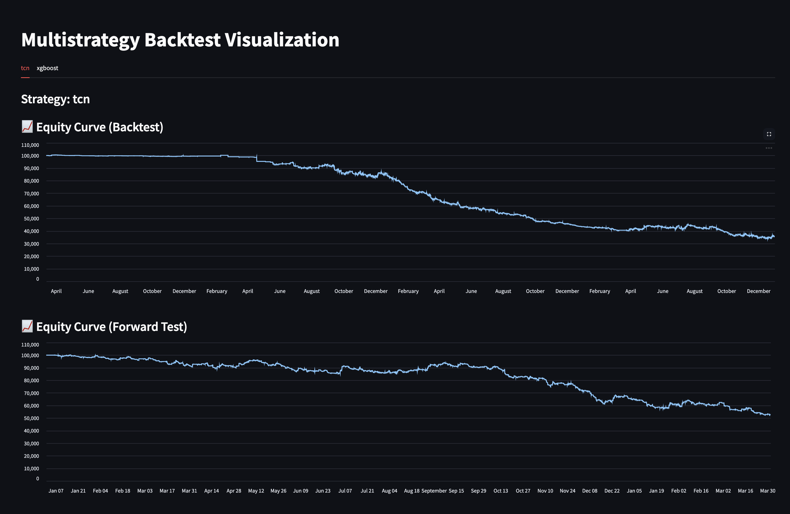
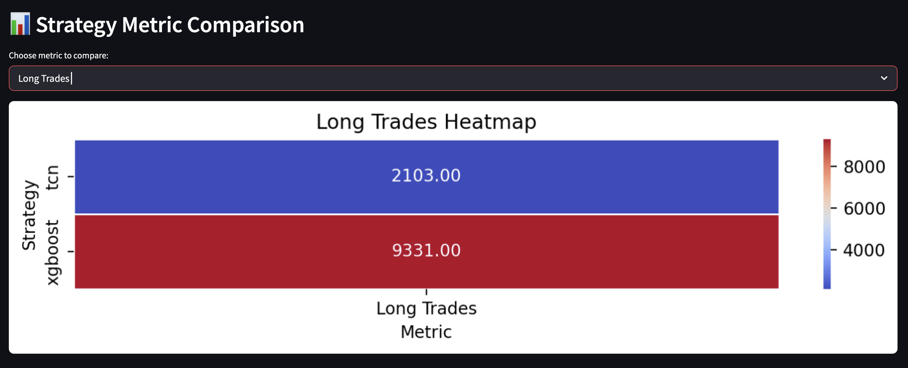

## Run Multiple Backtest

### Prerequisites
Ensure you have:
- Installed QuantPilot and its dependencies, refer to <link>
- A working Python environment
- Sample data or your own time series DataFrame (BTC_DATA in this example)

### Step 1: Set Up Your Models and Strategies
```py
from quantpilot.models import get_model
from quantpilot.strategy import MLStrategy

# Initialize models and wrap them into strategies
tcn_strategy = MLStrategy(get_model("TCN"))
xgb_strategy = MLStrategy(get_model("XGBoost"))
```

### Step 2: Create and Configure the Multibacktester
```py
from sample_data import BTC_DATA  # Your historical OHLCV or price dataset
from quantpilot.multibacktester import Multibacktester

bt = Multibacktester(
    data=BTC_DATA,
    strategies=[tcn_strategy, xgb_strategy],
    strategy_names=["TCN", "XGBoost"],
    mode="geometric", 
    entry_exit_logic="mean_reversion"  # or 'trend_following'
)
```

### Step 3: Run All Backtests (with Optional Forward Testing)
```py
bt.run_all(
    forward_test=True, 
    forward_start_date="2024-01-01"  # Optional: Set a forward testing period
)
```

### Optional: Visualize Performance Metric Heatmap
```py
bt.plot_permutation_heatmap(metric="Sharpe Ratio")
```

### Step 4: Launch the Streamlit Dashboard
```py
from quantpilot.visualization.run import run_dashboard

# Launch Streamlit app in your default browser
run_dashboard()
```
### Final Outcome
```
Running backtest for: TCN
STRATEGY NAME: TCN
Running backtest phase...
torch.Size([33063, 3])
Entry/Exit Logic: Mean Reversion
Mode: Geometric

Running forward test phase...
torch.Size([10793, 3])
Entry/Exit Logic: Mean Reversion
Mode: Geometric

============================================================
                 BACKTEST PHASE PERFORMANCE                 
============================================================
Start Date              2020-03-13 02:00:00
End Date                2023-12-31 23:00:00
Duration (days)         1388
Data rows               33183
Initial Capital         $100,000.00
Final Equity            $35,580.70
Total Return            -64.42%
Annualized Return       -23.79%
Calmar Ratio            -0.36
Sharpe Ratio            -0.54
Sortino Ratio           -0.32
Max Drawdown            -66.02%
Number of Trades        7152
Long Trades             1434
Short Trades            2142
Win Rate                0.48
Average PnL             -1.87
Expectancy              -1.87
Profit Factor           0.97
Average Holding Period  0 days 01:08:30.402684563
Trade Frequency         0.22

============================================================
               FORWARD TEST PHASE PERFORMANCE               
============================================================
Start Date              2024-01-01 00:00:00
End Date                2025-03-31 22:00:00
Duration (days)         455
Data rows               10913
Initial Capital         $100,000.00
Final Equity            $52,744.36
Total Return            -47.26%
Annualized Return       -40.14%
Calmar Ratio            -0.84
Sharpe Ratio            -0.53
Sortino Ratio           -0.47
Max Drawdown            -47.89%
Number of Trades        3782
Long Trades             669
Short Trades            1222
Win Rate                0.50
Average PnL             11.13
Expectancy              11.13
Profit Factor           1.10
Average Holding Period  0 days 01:08:20.687466948
Trade Frequency         0.35
============================================================
Results saved to output/portfolio_tcn.csv
Trades saved to output/trade_tcn.csv
Records saved to output/records_tcn.csv

Running backtest for: XGBoost
STRATEGY NAME: XGBoost
Running backtest phase...
Entry/Exit Logic: Mean Reversion
Mode: Geometric

Running forward test phase...
Entry/Exit Logic: Mean Reversion
Mode: Geometric

============================================================
                 BACKTEST PHASE PERFORMANCE                 
============================================================
Start Date              2020-03-13 02:00:00
End Date                2023-12-31 23:00:00
Duration (days)         1388
Data rows               33183
Initial Capital         $100,000.00
Final Equity            $-343,147.48
Total Return            -443.16%
Annualized Return       nan%
Calmar Ratio            nan
Sharpe Ratio            -1.02
Sortino Ratio           -1.16
Max Drawdown            -428.33%
Number of Trades        28125
Long Trades             7031
Short Trades            7031
Win Rate                0.59
Average PnL             4.62
Expectancy              4.62
Profit Factor           1.05
Average Holding Period  0 days 02:22:13.295406058
Trade Frequency         0.85

============================================================
               FORWARD TEST PHASE PERFORMANCE               
============================================================
Start Date              2024-01-01 00:00:00
End Date                2025-03-31 22:00:00
Duration (days)         455
Data rows               10913
Initial Capital         $100,000.00
Final Equity            $-231,334.59
Total Return            -331.39%
Annualized Return       nan%
Calmar Ratio            nan
Sharpe Ratio            -1.42
Sortino Ratio           -1.76
Max Drawdown            -336.55%
Number of Trades        9201
Long Trades             2300
Short Trades            2300
Win Rate                0.59
Average PnL             14.02
Expectancy              14.02
Profit Factor           1.08
Average Holding Period  0 days 02:22:41.739130434
Trade Frequency         0.84
============================================================
Results saved to output/portfolio_xgboost.csv
Trades saved to output/trade_xgboost.csv
Records saved to output/records_xgboost.csv
```
### With Visualization


